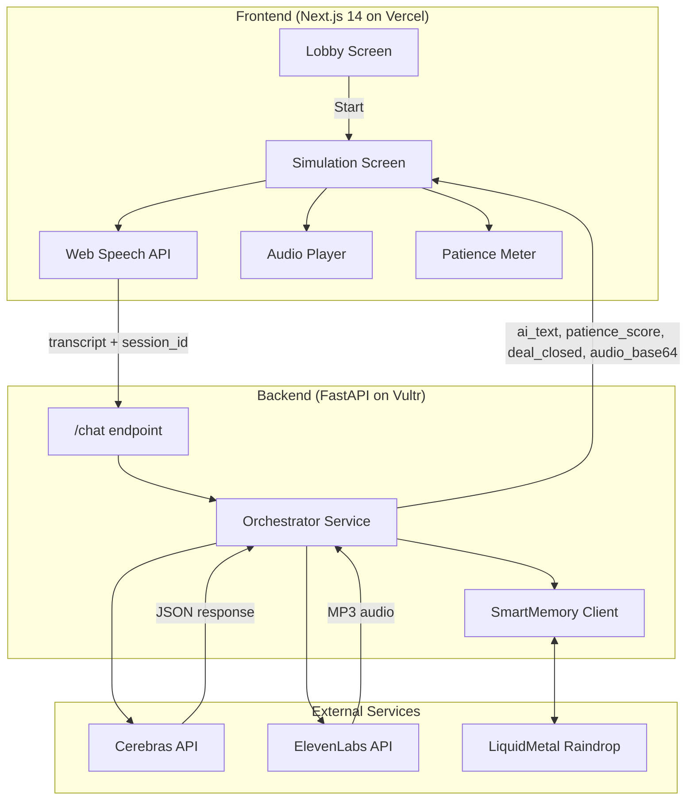

# Design Document: Dealfu

## Overview

Dealfu is a real-time AI sales simulation application built as a monorepo with a Next.js 14 frontend and Python FastAPI backend. The system uses a server-side orchestration pattern where the backend handles all AI (Cerebras) and voice (ElevenLabs) processing, returning a single consolidated response to minimize latency and hide API keys.

The core interaction loop is:
1. User clicks Action Button to start recording
2. Browser's Web Speech API transcribes speech locally
3. User clicks to stop → transcript sent to backend
4. Backend: Cerebras evaluates → ElevenLabs generates voice → returns consolidated JSON
5. Frontend plays audio, updates Patience Meter, checks win/loss conditions

## Architecture



## Components and Interfaces

### Frontend Components

| Component | Responsibility |
|-----------|---------------|
| `LobbyScreen` | Landing page with "Start Simulation" button, app title |
| `SimulationScreen` | Main game screen with Action Button, Patience Meter, conversation display |
| `ActionButton` | Click-to-talk toggle button with Idle/Recording/Disabled states |
| `PatienceMeter` | Animated 0-100% progress bar with color feedback |
| `Toast` | Notification component for errors and empty input feedback |
| `GameOverScreen` | Loss screen with "Call Failed" message and retry button |
| `WinScreen` | Victory screen with confetti animation and replay button |
| `useSpeechRecognition` | Custom hook wrapping Web Speech API |
| `useAudioPlayer` | Custom hook for audio playback with onEnded callback |

### Backend Services

| Service | Responsibility |
|---------|---------------|
| `ChatRouter` | FastAPI router handling `/chat` POST endpoint |
| `OrchestratorService` | Coordinates Cerebras call → ElevenLabs call → response assembly |
| `CerebrasClient` | Wrapper for Cerebras API with JSON response parsing |
| `ElevenLabsClient` | Wrapper for ElevenLabs TTS API, requests MP3 format |
| `SmartMemoryClient` | Wrapper for LiquidMetal Raindrop SmartMemory operations |
| `PatienceCalculator` | Calculates new patience score based on sentiment |

### API Interfaces

#### POST /chat

**Request:**
```typescript
{
  session_id: string;      // UUID from frontend
  user_text: string;       // Transcribed speech
  current_patience: number; // Current meter value (0-100)
}
```

**Response:**
```typescript
{
  ai_text: string;         // AI persona's response text
  patience_score: number;  // New patience value (0-100)
  deal_closed: boolean;    // Win condition flag
  audio_base64: string;    // MP3 audio encoded as base64
}
```

#### Cerebras Prompt Response Schema
```typescript
{
  text: string;            // AI response text
  sentiment: "positive" | "negative" | "neutral";
  deal_closed: boolean;
}
```

## Data Models

### Frontend State

```typescript
interface SimulationState {
  sessionId: string;           // crypto.randomUUID()
  patienceScore: number;       // 0-100, starts at 50
  buttonState: 'idle' | 'recording' | 'disabled';
  isPlaying: boolean;          // Audio playback state
  conversationHistory: Message[];
  gameStatus: 'playing' | 'won' | 'lost';
}

interface Message {
  role: 'user' | 'ai';
  text: string;
  timestamp: number;
}
```

### Backend Models

```python
class ChatRequest(BaseModel):
    session_id: str
    user_text: str
    current_patience: int

class ChatResponse(BaseModel):
    ai_text: str
    patience_score: int
    deal_closed: bool
    audio_base64: str

class CerebrasResponse(BaseModel):
    text: str
    sentiment: Literal["positive", "negative", "neutral"]
    deal_closed: bool

class ConversationEntry(BaseModel):
    role: Literal["user", "assistant"]
    content: str
    timestamp: datetime
```


## Patience Score Logic

```python
def calculate_patience(current: int, sentiment: str) -> int:
    """
    Calculate new patience score based on AI sentiment.
    - positive: +15 points
    - negative: -20 points  
    - neutral: no change
    Clamped to 0-100 range.
    """
    delta = {
        "positive": 15,
        "negative": -20,
        "neutral": 0
    }
    new_score = current + delta.get(sentiment, 0)
    return max(0, min(100, new_score))
```

## AI Persona System Prompt

```
You are "The Skeptic CTO" - a busy, skeptical technology executive evaluating a sales pitch. 

Your personality:
- Time-conscious and impatient with fluff
- Technically savvy - you see through buzzwords
- Respectful but direct
- You've heard every pitch before

Your job:
- Listen to the salesperson's pitch
- Respond with realistic objections OR agreement
- If genuinely convinced, you may agree to a meeting

ALWAYS respond with valid JSON in this exact format:
{
  "text": "Your spoken response here",
  "sentiment": "positive" | "negative" | "neutral",
  "deal_closed": true | false
}

Rules for sentiment:
- "positive": The pitch addressed your concerns well, you're warming up
- "negative": The pitch was weak, vague, or didn't answer your question
- "neutral": The pitch was okay but didn't move the needle

Rules for deal_closed:
- Set to true ONLY if you're genuinely convinced and ready to schedule a meeting
- This should be rare - you're a tough sell
```

## Error Handling

| Error Type | Handling Strategy |
|------------|-------------------|
| Network failure to backend | Show toast "Connection unstable. Say that again?", re-enable button, no patience deduction |
| Cerebras returns invalid JSON | Retry up to 2 times, then return error response |
| ElevenLabs API failure | Return response without audio, frontend shows text-only |
| Empty transcript | Frontend catches before API call, shows "I didn't hear anything." toast |
| Web Speech API unsupported | Show error recommending Chrome/Edge |

## Testing Strategy

### Testing Framework Selection

- **Frontend**: Vitest + React Testing Library for unit tests, fast-check for property-based tests
- **Backend**: pytest + pytest-asyncio for unit tests, hypothesis for property-based tests

### Unit Testing Approach

Unit tests will cover:
- Component rendering and state transitions
- API response parsing
- Patience calculation logic
- Audio playback state management
- Error handling paths

### Property-Based Testing Approach

Property-based tests will verify universal properties that should hold across all inputs. Each property test will:
- Run a minimum of 100 iterations
- Be tagged with the correctness property it implements using format: `**Feature: dealfu, Property {number}: {property_text}**`
- Reference the requirements clause it validates


## Correctness Properties

*A property is a characteristic or behavior that should hold true across all valid executions of a system-essentially, a formal statement about what the system should do. Properties serve as the bridge between human-readable specifications and machine-verifiable correctness guarantees.*

Based on the prework analysis, the following properties can be verified through property-based testing:

### Property 1: Whitespace Input Rejection

*For any* string that is empty, null, or contains only whitespace characters, the system SHALL reject it without sending to the backend API and reset the button to Idle state.

**Validates: Requirements 2.4**

### Property 2: Valid Text Triggers API Call

*For any* string that contains at least one non-whitespace character, the system SHALL send it to the Backend API.

**Validates: Requirements 2.6**

### Property 3: Base64 Audio Round-Trip

*For any* valid MP3 binary data, encoding to base64 and then decoding SHALL produce the original binary data.

**Validates: Requirements 3.4**

### Property 4: Response Structure Completeness

*For any* successful backend response, the JSON SHALL contain all required fields: ai_text (string), patience_score (number 0-100), deal_closed (boolean), and audio_base64 (string).

**Validates: Requirements 3.5**

### Property 5: Patience Score Calculation

*For any* starting patience score (0-100) and sentiment value, the new score SHALL equal:
- current + 15 if sentiment is "positive"
- current - 20 if sentiment is "negative"  
- current + 0 if sentiment is "neutral"
And the result SHALL be clamped to the range [0, 100].

**Validates: Requirements 4.5**

### Property 6: Audio Mutex - Button Disabled During Playback

*For any* state where audio is currently playing, the Action Button SHALL be in disabled state.

**Validates: Requirements 6.1**

### Property 7: Disabled Button Ignores Input

*For any* sequence of tap events while the Action Button is disabled, the button state SHALL remain unchanged.

**Validates: Requirements 6.3**

### Property 8: Error Preserves Patience

*For any* API error response, the patience score SHALL remain equal to the score before the request was made.

**Validates: Requirements 7.2**

### Property 9: Session ID Uniqueness

*For any* two calls to crypto.randomUUID(), the generated session IDs SHALL be different.

**Validates: Requirements 9.1**

### Property 10: Cerebras Response Validation

*For any* JSON object, validation SHALL pass if and only if it contains:
- "text" field with string value
- "sentiment" field with value in ["positive", "negative", "neutral"]
- "deal_closed" field with boolean value

**Validates: Requirements 10.2, 10.4, 10.5**

